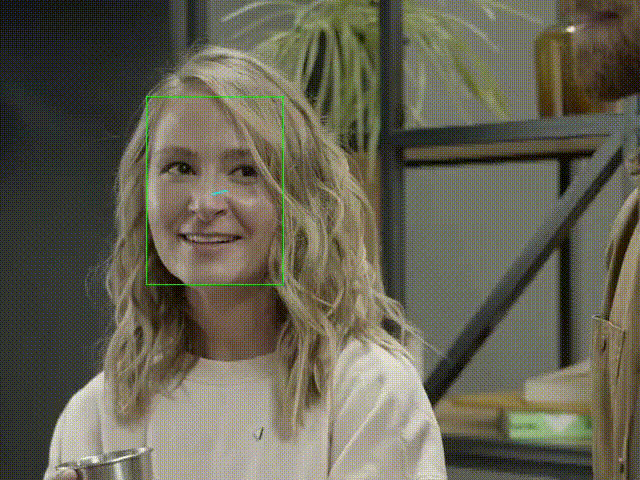
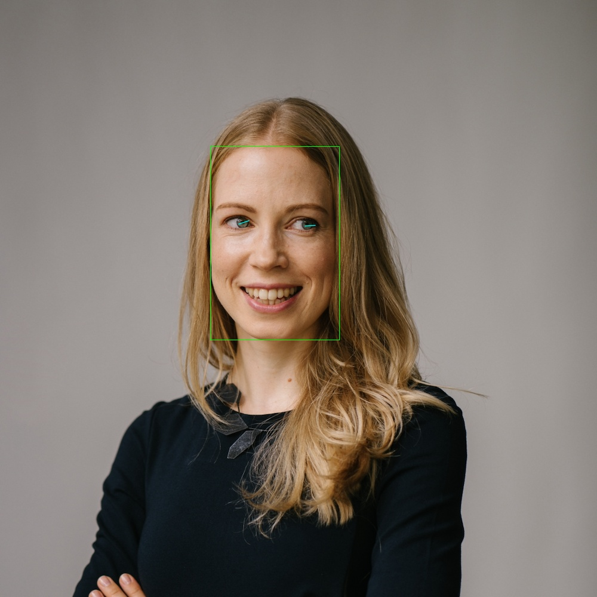

# A demo program of gaze estimation models (MPIIGaze, MPIIFaceGaze, ETH-XGaze)

[](https://pypi.org/project/ptgaze/)
[](https://colab.research.google.com/github/hysts/pytorch_mpiigaze_demo/blob/master/demo.ipynb)

With this program, you can run gaze estimation on images and videos.
By default, the video from a webcam will be used.






To train a model for MPIIGaze and MPIIFaceGaze,
use [this repository](https://github.com/hysts/pytorch_mpiigaze).

## Quick start

### Installation

```bash
pip install ptgaze
```


### Run demo

```bash
ptgaze --mode eth-xgaze
```


### Usage


```
usage: ptgaze [-h] [--config CONFIG] [--mode {mpiigaze,mpiifacegaze,eth-xgaze}]
              [--face-detector {dlib,face_alignment_dlib,face_alignment_sfd,mediapipe}]
              [--device {cpu,cuda}] [--image IMAGE] [--video VIDEO] [--camera CAMERA]
              [--output-dir OUTPUT_DIR] [--ext {avi,mp4}] [--no-screen] [--debug]

optional arguments:
  -h, --help            show this help message and exit
  --config CONFIG       Config file. When using a config file, all the other commandline arguments
                        are ignored. See
                        https://github.com/hysts/pytorch_mpiigaze_demo/ptgaze/data/configs/eth-
                        xgaze.yaml
  --mode {mpiigaze,mpiifacegaze,eth-xgaze}
                        With 'mpiigaze', MPIIGaze model will be used. With 'mpiifacegaze',
                        MPIIFaceGaze model will be used. With 'eth-xgaze', ETH-XGaze model will be
                        used.
  --face-detector {dlib,face_alignment_dlib,face_alignment_sfd,mediapipe}
                        The method used to detect faces and find face landmarks (default:
                        'mediapipe')
  --device {cpu,cuda}   Device used for model inference.
  --image IMAGE         Path to an input image file.
  --video VIDEO         Path to an input video file.
  --camera CAMERA       Camera calibration file. See https://github.com/hysts/pytorch_mpiigaze_demo/
                        ptgaze/data/calib/sample_params.yaml
  --output-dir OUTPUT_DIR, -o OUTPUT_DIR
                        If specified, the overlaid video will be saved to this directory.
  --ext {avi,mp4}, -e {avi,mp4}
                        Output video file extension.
  --no-screen           If specified, the video is not displayed on screen, and saved to the output
                        directory.
  --debug
```

While processing an image or video, press the following keys on the window
to show or hide intermediate results:

- `l`: landmarks
- `h`: head pose
- `t`: projected points of 3D face model
- `b`: face bounding box


## References

- Zhang, Xucong, Seonwook Park, Thabo Beeler, Derek Bradley, Siyu Tang, and Otmar Hilliges. "ETH-XGaze: A Large Scale Dataset for Gaze Estimation under Extreme Head Pose and Gaze Variation." In European Conference on Computer Vision (ECCV), 2020. [arXiv:2007.15837](https://arxiv.org/abs/2007.15837), [Project Page](https://ait.ethz.ch/projects/2020/ETH-XGaze/), [GitHub](https://github.com/xucong-zhang/ETH-XGaze)
- Zhang, Xucong, Yusuke Sugano, Mario Fritz, and Andreas Bulling. "Appearance-based Gaze Estimation in the Wild." Proc. of the IEEE Conference on Computer Vision and Pattern Recognition (CVPR), 2015. [arXiv:1504.02863](https://arxiv.org/abs/1504.02863), [Project Page](https://www.mpi-inf.mpg.de/departments/computer-vision-and-multimodal-computing/research/gaze-based-human-computer-interaction/appearance-based-gaze-estimation-in-the-wild/)
- Zhang, Xucong, Yusuke Sugano, Mario Fritz, and Andreas Bulling. "It's Written All Over Your Face: Full-Face Appearance-Based Gaze Estimation." Proc. of the IEEE Conference on Computer Vision and Pattern Recognition Workshops(CVPRW), 2017. [arXiv:1611.08860](https://arxiv.org/abs/1611.08860), [Project Page](https://www.mpi-inf.mpg.de/departments/computer-vision-and-machine-learning/research/gaze-based-human-computer-interaction/its-written-all-over-your-face-full-face-appearance-based-gaze-estimation/)
- Zhang, Xucong, Yusuke Sugano, Mario Fritz, and Andreas Bulling. "MPIIGaze: Real-World Dataset and Deep Appearance-Based Gaze Estimation." IEEE transactions on pattern analysis and machine intelligence 41 (2017). [arXiv:1711.09017](https://arxiv.org/abs/1711.09017)
- Zhang, Xucong, Yusuke Sugano, and Andreas Bulling. "Evaluation of Appearance-Based Methods and Implications for Gaze-Based Applications." Proc. ACM SIGCHI Conference on Human Factors in Computing Systems (CHI), 2019. [arXiv](https://arxiv.org/abs/1901.10906), [code](https://git.hcics.simtech.uni-stuttgart.de/public-projects/opengaze)
